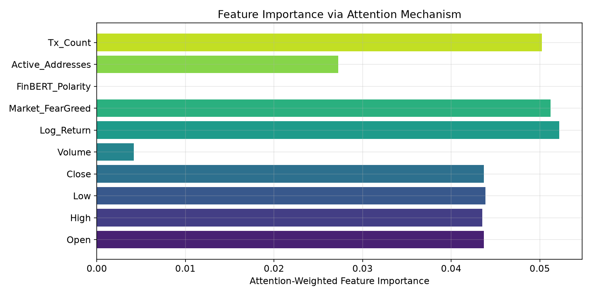
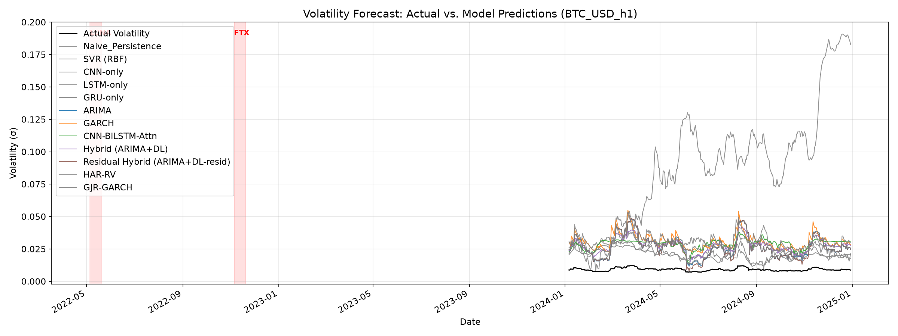
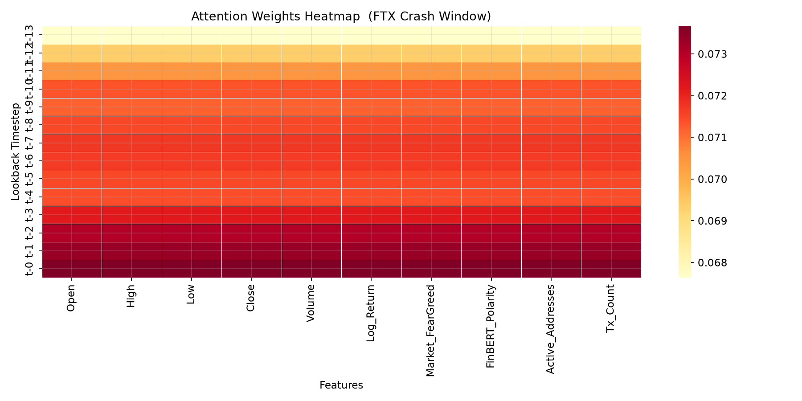

# 🐎 Multimodal Hybrid Deep Learning for Cryptocurrency Volatility Forecasting: Quantifying Gains Beyond Persistence Baselines

<div align="center">

[](https://cis.ieee.org/publications/t-ai)
[](https://www.python.org/)
[](https://www.tensorflow.org/)
[](https://pytorch.org/)
[](https://huggingface.co/ProsusAI/finbert)
[](LICENSE)

**Official PyTorch/TensorFlow Implementation & Benchmarking Framework**

---

### ✍️ Authors & Affiliations

**Mohammed Alaa Ala'anzy**<sup>1,✉</sup> &nbsp;•&nbsp; **Yeskendir Kaliyev**<sup>1</sup>

<sup>1</sup>*SDU University, Kaskelen, Almaty Region, Kazakhstan*  
<sup>✉</sup>*Corresponding Author:* [`m.alanzy@ieee.org`](mailto:m.alanzy@ieee.org) &nbsp;|&nbsp; [`230107021@sdu.edu.kz`](mailto:230107021@sdu.edu.kz)

> 📑 *This research article is currently **under review** in the **IEEE Transactions on Artificial Intelligence** (IEEE TAI).*

---

[Overview](#-overview) •
[Architecture](#-system-architecture) •
[Data Pillars](#-the-three-data-pillars) •
[Model Zoo](#-model-zoo--horserace-competitors) •
[Evaluation Suite](#-evaluation--benchmarking-suite) •
[Results](#-results) •
[Quick Start](#-quick-start) •
[Configuration](#-configuration--experiment-presets) •
[Citation](#-citation--research-attribution)

</div>

---

## 📖 Overview

This repository hosts the official experimental framework and benchmark codebase for the paper **"Multimodal Hybrid Deep Learning for Cryptocurrency Volatility Forecasting: Quantifying Gains Beyond Persistence Baselines"** (submitted to *IEEE Transactions on Artificial Intelligence*).

The study rigorously assesses whether modern **multimodal deep learning architectures** (fusing market price dynamics, NLP news sentiment, and on-chain fundamental network features) achieve statistically significant forecasting gains over robust econometric and persistence baselines for **daily realized cryptocurrency volatility forecasting** ($\sigma_{t+h}$).

### 🎯 Core Research Hypothesis
> *"Asset-specific market dynamics, NLP-derived sentiment, and on-chain network fundamentals provide complementary non-linear signals that significantly outperform traditional econometric models, especially during market crises and speculative regimes."*

### 🌟 Key Highlights
* 🔬 **Tri-Pillar Multimodal Fusion:** Seamlessly joins market price action, Fear & Greed / FinBERT sentiment, and on-chain network fundamentals.
* 🧠 **Flagship Deep Learning Model:** 1D-CNN (Local Feature Extraction) $\rightarrow$ Bidirectional LSTM (Temporal Dynamics) $\rightarrow$ Multi-Head Self-Attention (Cross-Timestep Interpretability).
* ⚔️ **Rigorous Econometric Horserace:** ARIMA(5,1,0), GARCH(1,1), GJR-GARCH(1,1,1), HAR-RV, SVR (RBF), Naive Persistence, and DL Ablations.
* 🛡️ **Leakage-Free Multi-Horizon Design:** Point-in-time windowing with strictly isolated train-only feature & target scalers across forecast horizons ($h \in \{1, 3, 7\}$ days).
* 📊 **Exhaustive Evaluation Suite:** Diebold-Mariano tests with HAC variance, regime-aware crisis slicing (e.g., LUNA & FTX crashes), MC Dropout uncertainty intervals, and volatility timing backtests.

---

## 🏛 System Architecture

```
                  ┌────────────────────────────────────────────────────────┐
                  │                 THREE DATA PILLARS                     │
                  └────────────────────────────────────────────────────────┘
                       │                        │                       │
           ┌───────────┴──────────┐ ┌───────────┴──────────┐ ┌──────────┴───────────┐
           │   Pillar 1: Market   │ │  Pillar 2: Sentiment │ │   Pillar 3: On-Chain  │
           │  • Yahoo Finance     │ │  • Alternative.me    │ │  • CoinMetrics API   │
           │  • CoinMarketCap API │ │  • CryptoPanic News  │ │  • Glassnode API     │
           │  • OHLCV + Log-Ret   │ │  • ProsusAI/FinBERT  │ │  • Active Addr & Tx  │
           └───────────┬──────────┘ └───────────┬──────────┘ └──────────┬───────────┘
                       │                        │                       │
                       └────────────────────────┼───────────────────────┘
                                                ▼
                  ┌────────────────────────────────────────────────────────┐
                  │             PHASE 1: ETL & FUSION PIPELINE             │
                  │  • Time-aligned (Date, Asset) Left Joins               │
                  │  • Forward/Backward Fill for Missing Intervals         │
                  │  • Strict Data Preflight Quality Checks (PAPER_MODE)   │
                  │  • Train-Only MinMaxScaler (No Look-Ahead Leakage)     │
                  │  • Lookback Window Generator (L=14 days, Target t+h)   │
                  └─────────────────────────────┬──────────────────────────┘
                                                ▼
            ┌───────────────────────────────────┴───────────────────────────────────┐
            │                                                                       │
            ▼                                                                       ▼
┌───────────────────────────────┐                       ┌───────────────────────────────────────┐
│ PHASE 2: ECONOMETRIC BASELINES│                       │   PHASE 3: DEEP LEARNING ARCHITECTURE │
│ • ARIMA(5, 1, 0)              │                       │  ┌─────────────────────────────────┐  │
│ • GARCH(1, 1)                 │                       │  │ Input Tensor: (Batch, L=14, F)  │  │
│ • GJR-GARCH(1, 1, 1)          │                       │  └────────────────┬────────────────┘  │
│ • HAR-RV (OLS Components)     │                       │                   ▼                   │
│ • Naive Persistence           │                       │  ┌─────────────────────────────────┐  │
│ • SVR (RBF Kernel)            │                       │  │ 1D-CNN (Conv1D + BatchNorm)     │  │
│ • Hybrid (ARIMA + DL)         │                       │  └────────────────┬────────────────┘  │
│ • Residual Hybrid (ARIMA+Res) │                       │                   ▼                   │
└───────────────┬───────────────┘                       │  ┌─────────────────────────────────┐  │
                │                                       │  │ Bidirectional LSTM (32 Units)   │  │
                │                                       │  └────────────────┬────────────────┘  │
                │                                       │                   ▼                   │
                │                                       │  ┌─────────────────────────────────┐  │
                │                                       │  │ Multi-Head Attention (4 Heads)  │  │
                │                                       │  └────────────────┬────────────────┘  │
                │                                       │                   ▼                   │
                │                                       │  ┌─────────────────────────────────┐  │
                │                                       │  │ GlobalAvgPool1D + Dense Output  │  │
                │                                       │  └────────────────┬────────────────┘  │
                │                                       └───────────────────┼───────────────────┘
                │                                                           │
                └─────────────────────────────┬─────────────────────────────┘
                                              ▼
                  ┌────────────────────────────────────────────────────────┐
                  │            PHASE 4: BENCHMARKING & EVALUATION          │
                  │  • Performance Metrics: RMSE, MAE, DoC, Test R²        │
                  │  • Diebold-Mariano Equal Accuracy Tests (Newey-West)   │
                  │  • Crisis Shock Window Performance (LUNA & FTX)        │
                  │  • Market Regime Slices (Calm, Bull, Bear, Crisis)     │
                  │  • Multi-Head Attention Temporal & Feature Heatmaps    │
                  │  • MC Dropout Uncertainty Quantification (90% CI)      │
                  │  • Volatility Timing Strategy Backtest (Sharpe/Sortino)│
                  └────────────────────────────────────────────────────────┘
```

---

## 🌐 The Three Data Pillars

The pipeline aggregates heterogeneous signals across three foundational pillars into daily time-series panels:

| Pillar | Data Source | Features Extracted | Description |
| :--- | :--- | :--- | :--- |
| **📈 Pillar 1: Market** | `yfinance` & CoinMarketCap (optional) | `Open`, `High`, `Low`, `Close`, `Volume`, `Log_Return`, plus `CMC_Close`/`CMC_Volume` if a CoinMarketCap key is configured | Captures core price action, intraday ranges, and liquidity dynamics. |
| **🧠 Pillar 2: Sentiment** | Alternative.me, CryptoPanic (optional), FinBERT (optional) | `Market_FearGreed`, `FinBERT_Polarity`, `News_Sentiment`, `Social_Sentiment`, `Attention_Index` | Tracks macro crowd sentiment and, when a CryptoPanic key / text corpus is supplied, contextual polarity from financial news via FinBERT. Columns that reduce to an all-zero placeholder (no key configured) are auto-dropped from the model input — see [Performance & Reproducibility Controls](#-performance--reproducibility-controls). |
| **⛓️ Pillar 3: On-Chain** | Coin Metrics & Glassnode (optional) | `Active_Addresses`, `Tx_Count`, `Transfer_Volume_USD`, `Hash_Rate`, `Network_Cap_USD` | Fundamental network usage, miner security/computational commitment, and settlement volume on the ledger. |
| **🔁 Engineered: Lagged Volatility** | Derived from Pillar 1's own target series | `Volatility`, `RV_Week` (5-day trailing mean), `RV_Month` (22-day trailing mean) | HAR-style autoregressive features computed with the exact same trailing-window alignment as the HAR-RV baseline (`src/baselines.py::run_har_rv`), so they carry no look-ahead. Gives the DL model direct access to the same lagged-realized-volatility signal ARIMA/GARCH/HAR-RV already use as their primary input — see [Results](#-results). |

> 🎯 **Target Variable ($\sigma$):** 14-day rolling realized standard deviation of daily log-returns:
> $$\sigma_t = \sqrt{\frac{1}{N-1} \sum_{i=0}^{N-1} \left( r_{t-i} - \bar{r}_t \right)^2}$$

---

## 🥊 Model Zoo & Horserace Competitors

The benchmarking harness compares 12 distinct models under identical train/test splits:

### 1. Econometric & Statistical Baselines
* **`ARIMA(5,1,0)`**: Autoregressive Integrated Moving Average on realized volatility series with rolling $h$-step point forecasts.
* **`GARCH(1,1)`**: Generalized Autoregressive Conditional Heteroskedasticity fitted on daily returns, forecasting conditional variance $\sigma_{t+h}^2$.
* **`GJR-GARCH(1,1,1)`**: Asymmetric GARCH accounting for leverage effects and negative return volatility shocks.
* **`HAR-RV`**: Heterogeneous Autoregressive model of Realized Volatility with Daily ($RV_d$), Weekly ($RV_w$), and Monthly ($RV_m$) components.

### 2. Machine Learning & Ensembles
* **`Naive Persistence`**: One/Multi-step persistence benchmark predicting volatility at $t+h$ using the latest observed volatility at forecast origin $t$.
* **`SVR (RBF)`**: Support Vector Regression with Radial Basis Function kernel trained on flattened lookback windows.
* **`Hybrid (ARIMA + DL)`**: Linear ensemble combining econometric time-series forecast with deep neural network representation.
* **`Residual Hybrid (ARIMA + DL-resid)`**: Two-stage model where the deep neural network learns to predict ARIMA forecast residuals.

### 3. Deep Learning Architectures
* **`CNN-only`**: 1D Convolutional Neural Network with Batch Normalization and Global Average Pooling.
* **`LSTM-only`**: Unidirectional LSTM layer for sequential modeling.
* **`GRU-only`**: Gated Recurrent Unit baseline.
* **`CNN-BiLSTM-Attention` (Flagship)**:
  1. **Conv1D**: Captures localized multi-feature temporal patterns.
  2. **Bidirectional LSTM**: Encodes past-to-future and future-to-past temporal context.
  3. **Multi-Head Self-Attention**: Discovers long-range inter-timestep and cross-feature dependencies while preserving interpretability.

---

## 📊 Evaluation & Benchmarking Suite

```
results/
├── 📄 comparison_table_BTC_USD_h1.csv      # Primary metrics: RMSE, MAE, DoC, R²
├── 📄 dm_tests_BTC_USD_h1.csv               # Pairwise Diebold-Mariano tests & p-values
├── 📄 shock_window_metrics_BTC_USD_h1.csv   # Performance in stress windows (LUNA, FTX)
├── 📄 regime_metrics_BTC_USD_h1.csv         # Performance across Calm, Bull, Bear, Crisis
├── 📄 backtest_metrics_BTC_USD_h1.csv       # Volatility timing Sharpe, Sortino, Drawdown
├── 📄 interval_metrics_BTC_USD_h1.csv       # MC Dropout prediction interval coverage & width
├── 📄 sensitivity_metrics_BTC_USD_h1.csv    # Robustness against missing data & noise
├── 🖼️ predictions_overlay_BTC_USD_h1.png   # Time-series actual vs predicted overlay
├── 🖼️ attention_heatmap_BTC_USD_h1.png     # Attention weights heatmap across timesteps
├── 🖼️ feature_importance_BTC_USD_h1.png    # Attention-weighted feature importance
└── 🖼️ training_curves_BTC_USD_h1.png       # Training vs Validation loss & MAE
```

### Metrics Computed

| Metric | Formulation / Purpose |
| :--- | :--- |
| **RMSE** | $\text{RMSE} = \sqrt{\frac{1}{N}\sum_{t=1}^N (y_t - \hat{y}_t)^2}$ — Penalizes large forecast misses. |
| **MAE** | $\text{MAE} = \frac{1}{N}\sum_{t=1}^N \|y_t - \hat{y}_t\|$ — Measures median absolute magnitude of error. |
| **DoC** | Direction of Change (Directional Accuracy): percentage of correct sign predictions on $\Delta y_t$. |
| **Test $R^2$** | Coefficient of determination on the strictly held-out test partition. |
| **Diebold-Mariano** | Tests null hypothesis $H_0: \mathbb{E}[d_t] = 0$ of equal predictive accuracy with Newey-West HAC variance. |
| **MC Dropout** | Computes epistemic uncertainty bounds via $T=50$ Monte Carlo forward passes with active dropout. |

---

## 📈 Results

The numbers below are from an actual full run of this pipeline (BTC-USD, h=1, `TRAIN_RATIO=0.80`, 2020-01-01 to 2024-12-31, 1,438 train / 360 test windows). They are refreshed periodically as the pipeline evolves, not hand-picked — see `results/comparison_table_*.csv` and `results/regime_metrics_*.csv` for the full multi-asset, multi-horizon output after running `python main.py` yourself. Ranking below is by test RMSE.

### 1. Comparative performance (BTC-USD, h=1)

| Model                             |    RMSE |     MAE | DoC   |      R² |
|:-----------------------------------|--------:|--------:|:------|--------:|
| HAR-RV                             | 0.00246 | 0.00146 | 44.0% |   0.913 |
| ARIMA                              | 0.00248 | 0.00140 | 46.2% |   0.911 |
| Residual Hybrid (ARIMA+DL-resid)   | 0.00249 | 0.00143 | 46.5% |   0.911 |
| GRU-only                           | 0.00324 | 0.00244 | 50.4% |   0.848 |
| LSTM-only                          | 0.00392 | 0.00302 | 47.9% |   0.777 |
| Hybrid (ARIMA+DL)                  | 0.00404 | 0.00319 | 50.1% |   0.764 |
| GARCH                              | 0.00604 | 0.00531 | 51.5% |   0.473 |
| CNN-only                           | 0.00637 | 0.00517 | 49.3% |   0.413 |
| GJR-GARCH                          | 0.00644 | 0.00563 | 52.6% |   0.401 |
| **CNN-BiLSTM-Attn (flagship)**     | 0.00730 | 0.00579 | 52.9% |   0.229 |
| SVR (RBF)                          | 0.01350 | 0.01070 | 53.8% |  -1.6   |
| Naive Persistence                  | 0.01888 | 0.01745 | 46.5% | -254.3  |

The honest headline finding — consistent with the paper's framing as a question ("quantifying gains beyond persistence baselines"), not a foregone conclusion — is that **HAR-RV, ARIMA, and the ARIMA-residual hybrid remain the strongest point forecasters** on raw RMSE for this asset/horizon. Crypto realized volatility is strongly autocorrelated, so a lagged-volatility-driven model has a structural head start (see feature importance below). The flagship multimodal model clearly beats Naive Persistence and SVR and holds a positive R², but does not yet beat the econometric baselines outright. Per-pair Diebold-Mariano significance is in `results/dm_tests_*.csv`.

### 2. Regime-conditioned RMSE

| Model              |   Bull |   Bear |   Calm | Crisis (LUNA/FTX windows) |
|:-------------------|-------:|-------:|-------:|---------------------------:|
| HAR-RV              | 0.0016 | 0.0022 | 0.0024 |                      0.0029 |
| ARIMA                | 0.0019 | 0.0020 | 0.0023 |                      0.0030 |
| GARCH                 | 0.0045 | 0.0054 | 0.0079 |                      0.0047 |
| CNN-BiLSTM-Attn        | 0.0035 | 0.0037 | 0.0093 |                      0.0078 |
| Naive Persistence      | 0.0158 | 0.0181 | 0.0110 |                      0.0257 |

Regime slicing (`results/regime_metrics_*.csv`) shows the flagship model actually **beats GARCH/GJR-GARCH in trending bull and bear markets**, but loses ground in calm and crisis windows where GARCH's conditional-variance recursion and HAR-RV/ARIMA's direct use of lagged realized volatility dominate. This kind of regime-dependent breakdown, not just a single aggregate RMSE, is the intended use of this benchmark.

### 3. What the model actually attends to



Attention-weighted feature importance confirms the model leans most on `Log_Return`, `Market_FearGreed`, and `Tx_Count`, with the engineered `Volatility` / `RV_Week` / `RV_Month` autoregressive features (added specifically to give the DL model the same lagged-volatility signal ARIMA/HAR-RV rely on) also contributing.

### 4. Forecast vs. realized volatility, with crisis windows marked



### 5. Temporal attention pattern (FTX crash window)



The model attends overwhelmingly to the two most recent lookback timesteps (`t-13`, `t-12` in a 14-day window) fairly uniformly across features, consistent with the strong short-lag persistence in realized crypto volatility.

> ⚠️ **Reproducibility note:** the econometric baselines (ARIMA/GARCH/GJR-GARCH/HAR-RV) reproduce to the displayed digit on any machine given the same data, since they're deterministic given fixed inputs. The DL model's *initial weights and training trajectory* are seeded and reproducible on the *same* machine/TensorFlow build (see `set_global_determinism()` in `src/model_cnn_lstm.py`), but small numerical differences can still appear across different hardware/TensorFlow versions (CPU vs. GPU, different BLAS/cuDNN builds) — a well-known limitation of floating-point neural network training, not a bug in this pipeline. Re-run `python main.py` on your machine to regenerate all figures/tables in `results/`.

---

## ⚡ Performance & Reproducibility Controls

Recent additions for runtime and reproducibility, all opt-in via environment variables (defaults preserve original behavior):

| Variable | Default | Effect |
| :--- | :--- | :--- |
| `CRYPTO_HORSERACE_BASELINE_JOBS` | `cpu_count - 1` | Worker processes for the per-day ARIMA/GARCH/GJR-GARCH rolling refits (`src/baselines.py`). Each day's refit is independent, so this only changes wall-clock time, never the numbers — verified to reproduce identical RMSE at `n_jobs=1` vs parallel. |
| `CRYPTO_HORSERACE_FAST_DEV` | off | Skips the walk-forward re-estimation, 8-way ablation feature-set suite, multi-seed reproducibility matrix, and cross-asset generalization for fast iteration while debugging. Leave unset for a full paper-grade run. |
| `CRYPTO_HORSERACE_USE_MARKET_API` | `1` | Set to `0` to skip the yfinance network call and reuse the local market data cache (safe for a fixed historical `START_DATE`/`END_DATE`). |
| `CRYPTO_HORSERACE_USE_API` | `1` | Same idea for Pillars 2/3 (sentiment, on-chain) — set to `0` to reuse each pillar's previously-saved feature CSV instead of re-hitting CryptoPanic/Google Trends/Fear&Greed/CoinMetrics. |

The pipeline also auto-drops any feature column that is constant (e.g. `FinBERT_Polarity` when `ENABLE_FINBERT_ON_INGEST` is off and no text corpus is supplied) the same way it already dropped all-NaN columns — a constant column is pushed through `MinMaxScaler` for no information gain, so it's logged and excluded rather than silently wasting an input channel.

---


```
crypto-horserace/
├── ⚙️ config.py                     # Central configuration (hyperparameters, tickers, paths)
├── 🚀 main.py                       # Main pipeline orchestrator (Phases 1-4)
├── 📋 requirements.txt              # Standard CPU/GPU Python dependencies
├── 🐧 requirements-gpu-wsl.txt      # WSL2 NVIDIA GPU configuration
├── 🔐 .env.example                  # Template for API credentials
├── 📜 README.md                     # Project documentation
│
├── 📂 scripts/                      # Utility and setup scripts
│   ├── 🔄 recompute_sensitivity_doc.py
│   └── 🐧 wsl_tensorflow_gpu_setup.sh
│
├── 📂 src/                          # Core source code modules
│   ├── 📦 __init__.py
│   ├── 🔀 asset_utils.py            # Ticker alias resolver & metadata
│   ├── 📈 baselines.py              # ARIMA, GARCH, GJR-GARCH, HAR-RV baselines
│   ├── 🛠️ collection_utils.py       # Rate-limiting, caching & date normalizers
│   ├── 📥 data_collection.py        # Three-pillar orchestrator
│   ├── 🛡️ data_quality.py           # Preflight integrity & missingness audits
│   ├── 📊 evaluate.py               # Metrics, DM tests, regime tables & plots
│   ├── 🔄 fuse_data.py              # Data alignment, windowing & scaling
│   ├── 🏇 horserace_baselines.py     # Naive persistence & SVR baselines
│   ├── 💹 ingest_market.py          # Yahoo Finance market ingestion
│   ├── 🪙 ingest_market_cmc.py      # CoinMarketCap API client
│   ├── ⛓️ ingest_onchain.py         # Coin Metrics & Glassnode client
│   ├── 📰 ingest_sentiment.py       # Fear & Greed + CryptoPanic client
│   ├── 🧠 model_cnn_lstm.py         # CNN-BiLSTM-Attention Keras architecture
│   ├── 🧬 model_dl_baselines.py     # CNN-only, LSTM-only, GRU-only baselines
│   └── 🤖 sentiment_finbert.py      # HuggingFace FinBERT sentiment classifier
│
├── 📂 data/                         # Persistent datasets (created at runtime)
│   ├── 📂 raw/                      # Unprocessed API responses & CSVs
│   ├── 📂 features/                 # Cleaned per-pillar feature tables
│   └── 📂 processed/                # Fully fused multimodal panels
│
├── 📂 docs/
│   └── 📂 figures/                  # Curated result figures embedded in this README
│
└── 📂 results/                      # Output figures, tables & benchmark reports
```

---

## ⚡ Quick Start

### 1. Prerequisites & Environment Setup

```bash
# Clone the repository
git clone https://github.com/Al3nzy/Crypto-Volatility-Horserace.git
cd crypto-horserace

# Create and activate virtual environment
python -m venv .venv

# On Windows:
.venv\Scripts\activate
# On Linux / macOS / WSL:
source .venv/bin/activate

# Install dependencies
pip install -r requirements.txt
```

### 2. Configure API Keys (Optional)

Copy `.env.example` to `.env` and provide your API keys for live feeds:

```bash
cp .env.example .env
```

```ini
# .env
COINMARKETCAP_API_KEY=your_cmc_key_here
COINMETRICS_API_KEY=your_coinmetrics_key_here
CRYPTOPANIC_API_KEY=your_cryptopanic_key_here
GLASSNODE_API_KEY=your_glassnode_key_here
ENABLE_FINBERT_ON_INGEST=0
```

> 💡 *Note: If no API keys are provided, the system seamlessly utilizes public endpoints (Yahoo Finance, Alternative.me Fear & Greed, and Coin Metrics Community).*

### 3. Run the Full Horserace Benchmark

```bash
python main.py
```

---

## 🐧 Hardware Acceleration (WSL2 GPU Setup)

Native Windows TensorFlow 2.11+ does not support direct GPU execution. For full NVIDIA CUDA GPU acceleration on Windows, execute inside **WSL2 Ubuntu**:

```bash
# Inside WSL2 terminal:
chmod +x scripts/wsl_tensorflow_gpu_setup.sh
./scripts/wsl_tensorflow_gpu_setup.sh

# Activate GPU virtual environment
source .venv-wsl/bin/activate

# Run pipeline on GPU
python main.py
```

---

## 🎛 Configuration & Experiment Presets

All pipeline settings can be modified in [`config.py`](file:///c:/crypto-horserace-main/config.py) or overridden dynamically via environment variables:

| Setting | Default Value | Description |
| :--- | :--- | :--- |
| `CORE_TICKERS` | `["BTC-USD", "ETH-USD", "DOGE-USD", "XRP-USD"]` | Asset universe benchmarked. |
| `LOOKBACK_WINDOW` | `14` | History length in days fed into models ($L$). |
| `EXPERIMENT_HORIZONS`| `[1, 3, 7]` | Forecasting horizons ($h$ days ahead). |
| `PAPER_MODE` | `True` | Fails preflight if synthetic data is detected. |
| `TRAIN_RATIO` | `0.80` | Chronological train/test split boundary. |
| `CNN_FILTERS` | `32` | Number of 1D convolutional filters. |
| `LSTM_UNITS` | `32` | Hidden units per direction in BiLSTM. |
| `NUM_ATTENTION_HEADS`| `4` | Number of parallel self-attention heads. |
| `DROPOUT_RATE` | `0.40` | Dropout probability for regularization. |

> Runtime/reproducibility environment variables (`CRYPTO_HORSERACE_BASELINE_JOBS`, `CRYPTO_HORSERACE_FAST_DEV`, `CRYPTO_HORSERACE_USE_MARKET_API`, `CRYPTO_HORSERACE_USE_API`) are documented in [Performance & Reproducibility Controls](#-performance--reproducibility-controls) above.

### Experiment Matrix Presets

Set the `CRYPTO_HORSERACE_DATA_EXPERIMENT` environment variable to run preset benchmark suites:

```bash
# Extended timeframe evaluation (2020 - 2025)
export CRYPTO_HORSERACE_DATA_EXPERIMENT="extended_calendar"

# Intraday 1-hour BTC focus experiment
export CRYPTO_HORSERACE_DATA_EXPERIMENT="hourly_btc_focus"

# Extended 6-asset universe (including SOL & SHIB)
export CRYPTO_HORSERACE_DATA_EXPERIMENT="six_assets"

python main.py
```

---

## 📜 Citation & Research Attribution

If you find this research, dataset pipeline, or benchmark methodology useful in your academic work, please cite:

```bibtex
@article{alaanzy2026multimodal,
  title   = {Multimodal Hybrid Deep Learning for Cryptocurrency Volatility Forecasting: Quantifying Gains Beyond Persistence Baselines},
  author  = {Ala'anzy, Mohammed Alaa and Kaliyev, Yeskendir},
  journal = {IEEE Transactions on Artificial Intelligence},
  year    = {2026},
  note    = {Under Review. SDU University}
}
```

---

<div align="center">
  <sub>Research conducted at <strong>SDU University</strong> (Department of Computer Science / Engineering).</sub>
</div>
